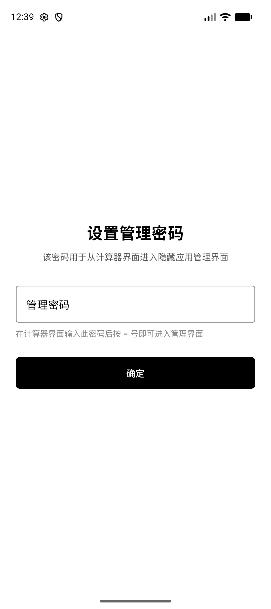
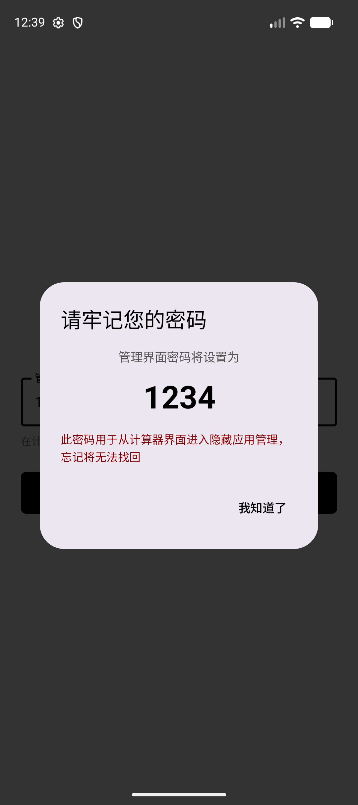
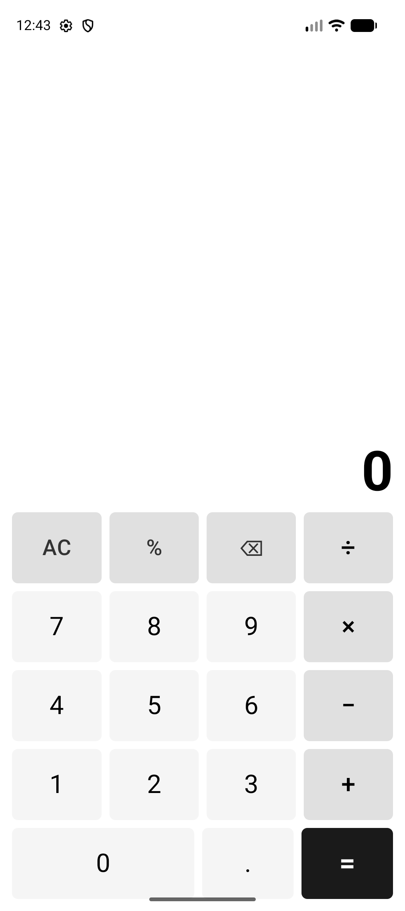
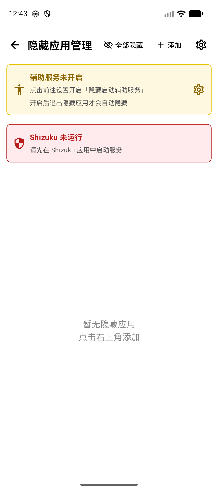
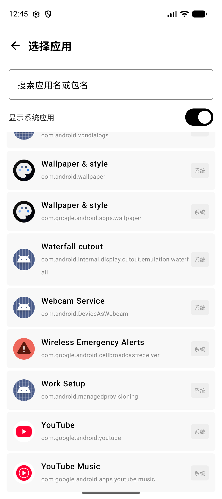

# GhostLaunch

GhostLaunch 是一款以计算器为伪装的 Android 应用隐藏启动工具。它通过 [Shizuku] 在设备上隐藏或恢复已安装的应用，并从伪装的计算器界面安全启动它们。

<p align="center">
  <a href="https://count.getloli.com" target="_blank">
    
  </a>
</p>

## 工作方式

GhostLaunch 呈现为一个功能齐全的计算器。在计算器中输入预设的管理密码并按下 `=`，即可进入隐藏应用管理界面。用户可以在管理界面添加需要隐藏的应用，并为每个应用单独设置启动密码——在计算器中输入对应密码并按 `=`，即可直接启动该应用。

应用隐藏通过 Shizuku 调用 `pm disable` / `pm enable` 实现。同时，可选的辅助功能服务会在用户离开隐藏应用时自动重新隐藏它。

## 核心特性

- 伪装成普通的计算器应用，支持基本的加减乘除运算
- 通过基于数字密码的手势访问隐藏管理界面和启动隐藏应用
- 利用 Shizuku 管理应用包的启用/禁用状态
- 可选辅助功能服务，自动检测退出并重新隐藏应用
- 为每个隐藏应用单独设置启动密码
- 基于 Jetpack Compose 和 Material 3 的界面设计

## 截图

<p>
  
  
  
  
  
</p>

## 前置要求

- Android 7.0 (API 24) 及以上
- 已安装并运行 [Shizuku]
- 如需自动重新隐藏功能，需开启辅助功能服务

## 构建

```bash
./gradlew assembleRelease
```

需要先安装 Shizuku 或通过 `local.properties` 中的 `sdk.dir` 设置 Android SDK 路径。发布版本通过 Gradle 属性或环境变量 `KEYSTORE_PASSWORD`、`KEY_PASSWORD` 和 `KEY_ALIAS` 进行签名。

## 许可证

[MIT](LICENSE)

[Shizuku]: https://github.com/RikkaApps/Shizuku
